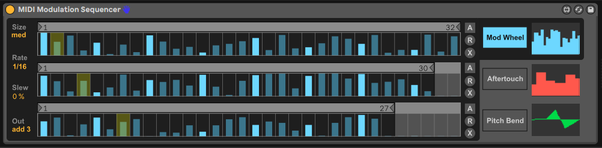

# Ableton MIDI Modulation Sequencer

An Ableton Live device for step sequencing MIDI modulation.

## Installation and Usage
1. [Download](https://github.com/adamjmurray/ableton-midi-modulation-sequencer/raw/master/releases/MIDI%20Modulation%20Sequencer%201.0.amxd)
2. Add the `MIDI Modulation Sequencer` MIDI effect device to a track in Live
3. Setup modulation for mod wheel, aftertouch, and/or pitch bend in an instrument in the same track
4. Change some sequencer steps
5. Start the transport (this device only outputs during playback)

Hover over the controls with the Live's Info View open to see explanations for everything.

## Features
* Indepedent sequencers of up to 64 steps for mod wheel, aftertouch, and pitch bend
* 3 step patterns in each sequencer with independent loop points for polyrhythms and pseudo-random patterns
* Slew control to smooth the output
* Multiple output modes combine the 3 step patterns in various ways: add 3 (normalized add), add, min, max, random
* Randomization and auto-randomization
